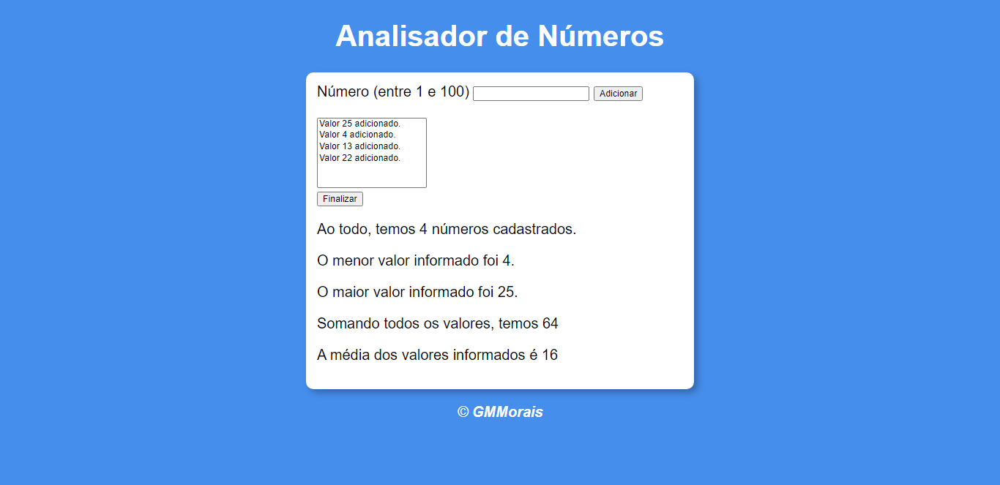

# Analisador de Números

[🔗 Clique aqui para acessar](https://biogmmorais.github.io/AnalisadorDeNumeros/)

> Curso em Vídeo (Youtube)

Nesse projeto utilizei Javascript para analisar números adicionados, mostrando a quantidade, o menor, maior, a soma deles e a média.

## 🛠 Tecnologias
- Javascript
- HTML
- CSS

## 📨 Contato

guilhermemm97@gmail.com